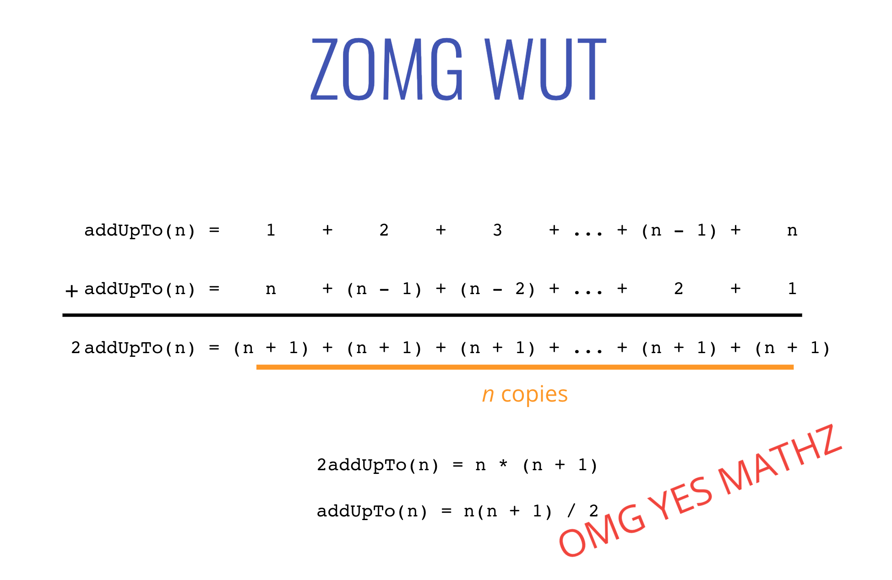

# Big O Notation

[Link to slides](https://cs.slides.com/colt_steele/big-o-notation#/)

---

### Objectives

* Motivate the need for something like Big O Notation
* Describe what Big O Notation is
* Simplify Big O Expressions
* Define "time complexity" and "space complexity"
* Evaluate the time complexity and space complexity of different algorithms using Big O Notation
* Describe what a logarithm is

---

### What's the idea here?

Imagine we have multiple implementations of the same function.

How can we determine which one is the "best?"

> "Write a function that accepts a string input and returns a reversed copy"

--- 

### Who Cares?
* It's important to have a precise vocabulary to talk about how our code performs
* Useful for discussing trade-offs between different approaches
* When your code slows down or crashes, identifying parts of the code that are inefficient can help us find pain points in our applications
* Less important: it comes up in interviews!

#### An Example

Suppose we want to write a function that calculates the sum of all numbers from 1 up to (and including) some number n.

``` javascript
function addUpTo(n) {
  let total = 0;
  for (let i = 1; i <= n; i++) {
    total += i;
  }
  return total;
}
```
``` javascript
function addUpTo(n) {
  return n * (n + 1) / 2;
}
```
**Which one is better?**


### What does better mean?
* Faster?
* Less memory-intensive?
* More readable?

#### Why not use timers?
``` javascript
function addUpTo(n) {
  let total = 0;
  for (let i = 1; i <= n; i++) {
    total += i;
  }
  return total;
}

let t1 = performance.now();
addUpTo(1000000000);
let t2 = performance.now();
console.log(`Time Elapsed: ${(t2 - t1) / 1000} seconds.`)
````
